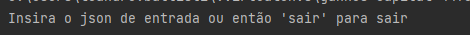

# Ganhos Capital
Projeto para avaliar ganhos de capital com entrada e saida

Desenvolvedor: Leandro Vilson Battisti

[REGRAS DE NEGÓCIO da implementação](./resources/spec-capital-gains-ptbr.pdf)

**Arquitetura Escolhida**: Port and Adapters

**Definição dos pacotes**
* adapter - pacote com o adapter de entrada de e saídas de dados para o pacote business. Hoje possuir apenas adaptador JSON
* business - pacote model. responsável por receber a lista de capital envolvido e devolver a lista de impostos
* repository - pacote de persistência
* service - pacote de ports para acesso aos recursos dos modelos de calculo. Hoje acessado pela  entrada da aplicação main.pý
***
**Técnica de desenvolvimento utilizada**: TDD + POO(programação orientada a objetivo)

**Linguagem utilizada**: Python, versão 3.10  
**Motivo Escolha da linguagem**: Dinamicidade e facilidade de desenvolvimento MVP
***
**Compilando e executando o projeto**
Passo 1 - executar o comando na raiz do projeto 
```sh
$ pipenv install
````

Passo 2 - executar o main
```sh
$ python3  source/main.py
````

Com isto será aberta uam janela interativa para ficar inserindo os jsons



Ao inserir um json valido será executada a aplicação e no console saira o resultado


    


